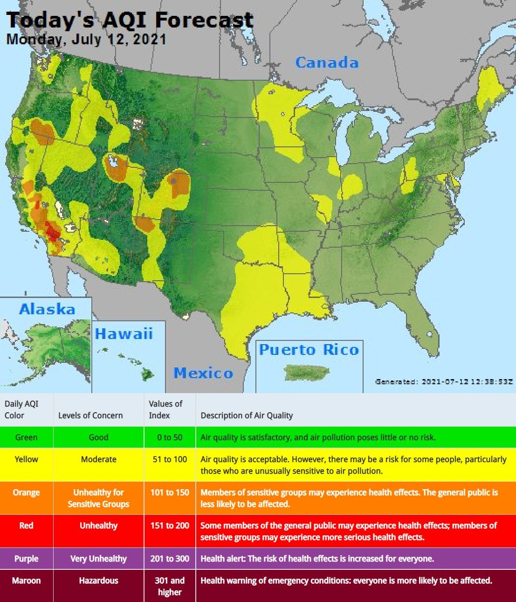

# US Air Quality Bot
A twitter bot that tweets the daily Air Quality Index (AQI) forecast from [AirNow.gov](AirNow.gov). Currently live on [Twitter!](https://twitter.com/air_qual_bot_us)

This bot runs every morning on a raspberry pi via a cron job:
```
0 8 * * * cd ~/aqi_bot/ && /usr/bin/python ~/aqi_bot/aqi_twitter_bot.py
```
## Example image:


